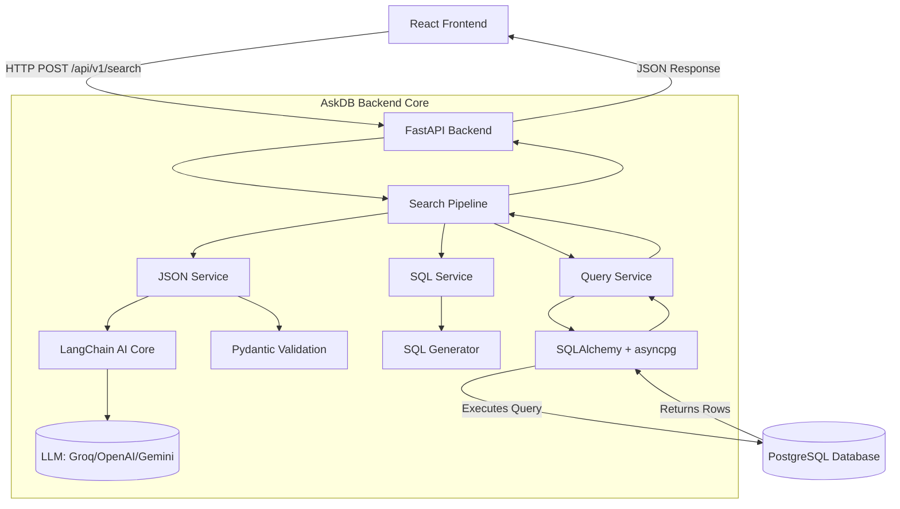
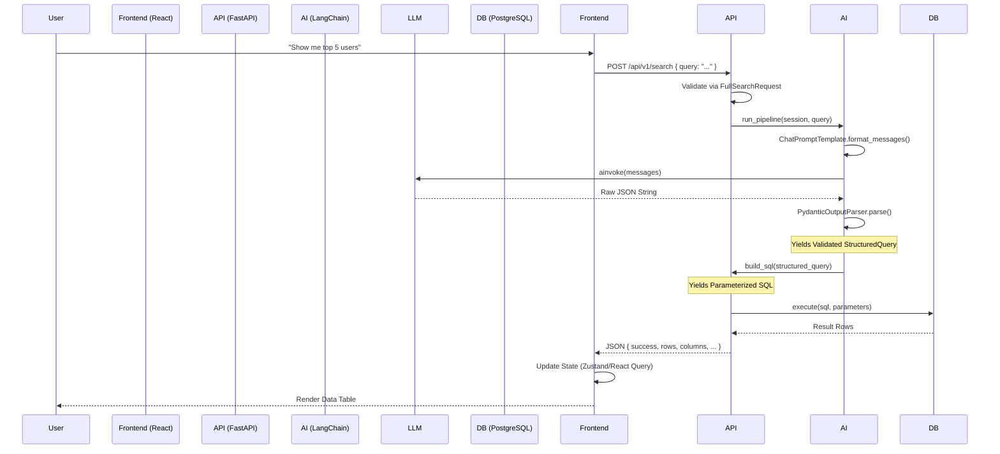

# AskDB Technical Engineering Guide

> **Note**: This document serves as a comprehensive, deep-dive architectural and engineering manual for the AskDB system. It explains not just *what* the code does, but *how* it operates internally, *why* specific technologies were chosen, and the exact flow of data through the ecosystem.

---

## 1. System Architecture Overview

AskDB is a modern web application designed to convert natural language queries into executable PostgreSQL commands, execute them securely, and display the results. 

### High-Level Architecture Diagram



---

## 2. The Request Lifecycle (Data Flow)

Every request in AskDB follows a strict, well-defined pipeline. This section traces a single user prompt from input to UI render.

### The Transformation Pipeline

1. **User Input**: Natural Language query typed into the UI (e.g., "Show me top 5 users by revenue").
2. **React State**: Managed locally in components, submitted via React Query.
3. **HTTP Request**: Axios sends a JSON payload to the FastAPI `/api/v1/search` endpoint.
4. **Python Object**: FastAPI's Request Model (`FullSearchRequest`) validates the payload using Pydantic.
5. **Search Pipeline (`search_pipeline.py`)**: The orchestrator takes over.
6. **Prompt Template**: `JSONGenerationChain` loads the prompt template.
7. **Rendered Prompt**: LangChain's `ChatPromptTemplate` injects database schema and format instructions.
8. **LLM Request**: LangChain sends the formatted prompt to the LLM (via `ProviderFactory` and `ChatGroq`/etc).
9. **Raw LLM Response**: The model returns a string containing a JSON payload.
10. **Output Parser**: LangChain's `PydanticOutputParser` extracts the JSON.
11. **Pydantic Validation**: `StructuredQuery` schema strictly validates the output, ensuring all fields, types, and constraints match exactly.
12. **Validated Python Object**: A fully typed `StructuredQuery` object is produced.
13. **SQL Generator**: `SQLGenerator` receives the `StructuredQuery` and constructs parameterized SQL syntax to prevent SQL injection.
14. **Parameterized SQL & Parameters**: Output is a tuple: `(sql_string, parameters_dict)`.
15. **SQLAlchemy & asyncpg**: `QueryService` uses an `AsyncSession` to execute the raw parameterized SQL against the DB via the `asyncpg` driver.
16. **Database Result**: PostgreSQL returns binary data, converted to Python objects by asyncpg/SQLAlchemy.
17. **Python Dictionary**: Rows are mapped to lists of dictionaries.
18. **JSON Response**: FastAPI serializes the `FullSearchResponse` back to the client.
19. **React Axios & TanStack Query**: The frontend receives the JSON, resolves the Promise, and TanStack Query caches the result.
20. **Rendered UI**: React components re-render to display the data table.

### Data Flow Diagram



### Pipeline Implementation (`backend/app/services/search/search_pipeline.py`)

**File Path:** `backend/app/services/search/search_pipeline.py`
**Class:** `SearchPipeline`
**Method:** `run_pipeline`

```python
async def run_pipeline(self, session: AsyncSession, natural_language: str) -> Dict[str, Any]:
    # 1. Natural Language -> Structured JSON
    structured_query = await self.json_service.process_query(natural_language)
    structured_json = structured_query.model_dump()
    
    # 2. Structured JSON -> Parameterized SQL
    sql, parameters = self.sql_service.build_sql(structured_json)
    
    # 3. SQL Execution -> Results
    db_result = await self.query_service.execute_query(session, sql, parameters)
    
    # 5. Construct Final Response
    return {
        "success": True,
        "question": natural_language,
        # ... mapped response fields
    }
```

**Why this approach?**
By separating the generation phase (`JSONService`) from the compilation phase (`SQLService`) and execution phase (`QueryService`), the system ensures high testability, fault tolerance, and tight security. The LLM is never trusted to write executable SQL directly. Instead, it writes an Abstract Syntax Tree (JSON), which AskDB strictly validates and compiles to parameterized SQL safely.

---

## 3. Backend Technologies & Implementation

### FastAPI

#### Part 1: General Explanation
FastAPI is a modern, high-performance web framework for building APIs with Python, based on standard Python type hints. It was created to solve the sluggishness of traditional frameworks like Django and Flask while offering automatic data validation and OpenAPI documentation out-of-the-box. 

Internally, it leverages Starlette for web routing and Pydantic for data validation. Concepts like Dependency Injection (`Depends()`) allow clean, modular management of resources like database connections and authentication. It is highly advantageous for AI applications where async/await is essential for non-blocking network calls to LLMs and databases.

#### Part 2: AskDB Implementation
**File Path:** `backend/app/api/v1/endpoints/search.py`
**Library:** `fastapi`

AskDB uses FastAPI to define non-blocking, typed HTTP endpoints. Let's look at the main search endpoint:

```python
@router.post("", response_model=FullSearchResponse)
async def full_search(
    request: FullSearchRequest,
    pipeline: SearchPipeline = Depends(get_search_pipeline),
    db: AsyncSession = Depends(get_db)
):
    try:
        result = await pipeline.run_pipeline(db, request.query)
        return FullSearchResponse(**result)
    except Exception as e:
        logger.exception(f"Search API Error (Full Pipeline): {str(e)}", exc_info=e)
        raise HTTPException(status_code=400, detail=str(e))
```

**Line-by-line breakdown:**
- `@router.post("", response_model=FullSearchResponse)`: Registers an HTTP POST endpoint. FastAPI uses the `FullSearchResponse` model to automatically serialize the return value and generate OpenAPI specs.
- `request: FullSearchRequest`: Automatically validates the incoming JSON body. If the client sends an invalid payload, FastAPI returns a 422 Unprocessable Entity *before* this function even runs.
- `pipeline: SearchPipeline = Depends(get_search_pipeline)`: FastAPI's Dependency Injection system. It instantiates the pipeline only when needed, allowing easy mocking during unit testing.
- `db: AsyncSession = Depends(get_db)`: Injects an asynchronous SQLAlchemy database session. The session's lifecycle (creation, yield, close) is managed entirely by FastAPI.
- `return FullSearchResponse(**result)`: The raw dictionary returned by the pipeline is unpacked and validated against the output schema.
- `raise HTTPException(status_code=400, detail=str(e))`: Traps pipeline errors and maps them to standard HTTP status codes.

**Execution Step:** From here, if successful, the serialized JSON is streamed across the network back to Axios on the frontend.

### LangChain

#### Part 1: General Explanation
LangChain is a framework for developing applications powered by language models. It was created to abstract the complexities of connecting LLMs (like OpenAI, Groq, or Anthropic) to external data sources, prompts, and parsers. 

Internally, LangChain relies on building "chains" of operations using the Runnable Interface (LCEL - LangChain Expression Language). Core concepts include PromptTemplates (dynamic string formatting), ChatModels (the LLM wrappers), and OutputParsers (turning string outputs into structured data). It is advantageous because it allows developers to swap out LLM providers effortlessly without rewriting logic.

#### Part 2: AskDB Implementation
AskDB specifically utilizes `ChatPromptTemplate`, `PydanticOutputParser`, and the `BaseChatModel` abstractions.

**File Path:** `backend/app/ai/chains/json_chain.py`
**Class:** `JSONGenerationChain`

```python
class JSONGenerationChain:
    def __init__(self):
        self.llm = get_llm()
        self.parser = PydanticOutputParser(pydantic_object=StructuredQuery)
        
    @retry(wait=wait_exponential(multiplier=1, min=2, max=10), stop=stop_after_attempt(3))
    async def generate(self, natural_language: str) -> StructuredQuery:
        prompt_text = self.prompt_service.load_prompt("json_generation.txt")
        prompt_template = ChatPromptTemplate.from_template(prompt_text)
        
        messages = prompt_template.format_messages(
            schema_info=self.schema_info,
            query=natural_language,
            format_instructions=self.parser.get_format_instructions()
        )
        
        response = await self.llm.ainvoke(messages)
        structured_query = self.parser.parse(response.content)
        return structured_query
```

**Components Explained:**
1. **`get_llm()`**: Sourced from `core/llm.py`, this dynamically fetches the active `BaseChatModel` via `ProviderFactory`. This is why AskDB can switch between Groq, OpenAI, and Gemini at runtime seamlessly.
2. **`PydanticOutputParser`**: Takes the `StructuredQuery` Pydantic class and generates strict JSON formatting instructions for the LLM. It then takes the raw string output from the LLM and attempts to parse it safely into the Pydantic object.
3. **`ChatPromptTemplate`**: Formats the system prompt, injecting the `schema_info` (database DDl metadata), the user's `query`, and the `format_instructions`.
4. **`self.llm.ainvoke(messages)`**: Asynchronously sends the prompt to the language model.
5. **`@retry`**: Tenacity decorator. If parsing or validation fails (which is common with LLMs), it automatically retries with exponential backoff.

**Why AskDB uses it?**
Without LangChain's Output Parsers, we would be relying on unstable Regex string matching to extract JSON from LLM responses (which often include markdown backticks and conversational filler). LangChain handles this cleanup, and if removed, we would have to build complex parsing heuristics manually.

### Pydantic

#### Part 1: General Explanation
Pydantic is a data validation and settings management library for Python. It enforces type hints at runtime. Created to bring type safety to Python APIs, it is the backbone of FastAPI.

Internally, when a dictionary is passed into a `BaseModel`, Pydantic aggressively parses and coerces the data. For example, if a model expects an integer and receives the string `"123"`, Pydantic converts it to `123`. If it receives `"abc"`, it raises a `ValidationError`. Its core concepts revolve around `BaseModel`, `Field` descriptors for metadata, and `model_dump()`/`model_validate()`. 

#### Part 2: AskDB Implementation
**File Path:** `backend/app/ai/structured_output/schemas.py`

Pydantic is the absolute crux of AskDB's safety guarantees.

```python
class FilterCondition(BaseModel):
    table: Optional[str] = Field(default=None, description="The table this field belongs to")
    field: str = Field(description="The column name to filter on")
    operator: OperatorEnum = Field(description="The comparison operator")
    value: str | int | float | list[str] | list[int] | list[float] | None = Field(default=None, description="The value to compare against")

class StructuredQuery(BaseModel):
    table: str = Field(description="The primary table to query from")
    joins: Optional[List[JoinCondition]] = Field(default=None, description="List of JOIN conditions")
    columns: List[str] = Field(description="List of columns to select...")
    filters: Optional[List[FilterCondition]] = Field(default=None, description="List of filter conditions")
    limit: Optional[int] = Field(default=50, description="Maximum number of rows to return")
```

**Line-by-line breakdown:**
- `BaseModel`: Inheriting from this enables the class to be validated automatically.
- `OperatorEnum`: Restricts the `operator` field to a specific set of SQL operators (e.g., `=`, `>`, `IN`). The LLM literally cannot output a malicious or invalid operator without triggering a `ValidationError`.
- `Field(description="...")`: These descriptions aren't just for developers. Because we use LangChain's `PydanticOutputParser`, these exact descriptions are injected into the LLM prompt to instruct the AI on exactly what data goes into each key.
- `limit: Optional[int] = Field(default=50)`: AskDB explicitly enforces a default hard-limit on queries. If the LLM omits it, Pydantic inserts `50`, ensuring we don't accidentally query millions of rows.

**Output:** Calling `structured_query.model_dump()` yields a standard Python dictionary stripped of methods, ready to be passed to the `SQLGenerator`.

### SQLAlchemy & asyncpg

#### Part 1: General Explanation
SQLAlchemy is the premier SQL toolkit and ORM for Python. It provides a full suite of well known enterprise-level persistence patterns. `asyncpg` is a database interface library designed specifically for PostgreSQL and Python/asyncio. It is insanely fast (often 3x faster than psycopg2) because it implements the PostgreSQL binary protocol directly rather than relying on C-libraries like libpq.

When used together, `SQLAlchemy` provides the query building and session management, while `asyncpg` acts as the underlying driver fulfilling the asynchronous IO operations.

#### Part 2: AskDB Implementation
**File Path:** `backend/app/database/session.py` & `backend/app/query_builder/sql_generator.py`

```python
async_session_maker = async_sessionmaker(
    engine, class_=AsyncSession, expire_on_commit=False, autoflush=False
)
```
Here, we configure an `async_sessionmaker` factory. `expire_on_commit=False` ensures that our objects don't detach and become inaccessible when the session commits, an important requirement for async operations.

**Dynamic SQL Generation:**
**File Path:** `backend/app/query_builder/sql_generator.py`

AskDB does NOT use an ORM to execute the user's natural language queries. Why? Because the queries are entirely dynamic and unpredictable. Instead, AskDB generates raw parameterized SQL.

```python
# From SQLGenerator.generate()
if op == "BETWEEN":
    param_name_1 = f"{param_name}_1"
    param_name_2 = f"{param_name}_2"
    where_clauses.append(f"{qual_field} BETWEEN :{param_name_1} AND :{param_name_2}")
    parameters[param_name_1] = f.value[0]
    parameters[param_name_2] = f.value[1]
```

**Explanation:**
This is a critical security implementation. The generator parses the `StructuredQuery` and creates raw SQL text, but it NEVER concatenates user values into the string. 
Instead, it inserts bind parameters (e.g., `:field_name_1`). The actual values are placed in a `parameters` dictionary.

When executed in `query_service.py`:
```python
result = await session.execute(text(sql), parameters)
```
SQLAlchemy's `text()` construct safely binds the parameters via `asyncpg`. This architecture makes AskDB **100% immune to SQL injection attacks** originating from the LLM or user input.

---

## 4. Frontend Technologies & Implementation

### React, Vite & React Router

#### Part 1: General Explanation
React is a declarative, component-based library for building UIs. AskDB uses Vite as the build tool—which leverages ES Modules for blazing-fast Hot Module Replacement (HMR)—replacing Webpack. React Router manages client-side navigation without full page reloads, making the app feel like a seamless desktop application.

#### Part 2: AskDB Implementation
**File Path:** `frontend/src/App.tsx`

```tsx
<Route
  path="search"
  element={
    <Suspense fallback={<PageLoader />}>
      <AISearchPage />
    </Suspense>
  }
/>
```
AskDB leverages `lazy()` and `Suspense` for code-splitting. Instead of loading the entire application bundle on first visit, the app only loads the components required for the current route. The `<PageLoader />` handles the UI gracefully while the chunk is fetched.

### Zustand

#### Part 1: General Explanation
Zustand is a small, fast, and scalable bearbones state-management solution using simplified flux principles. Unlike Redux, it doesn't require massive boilerplate, providers, or reducers. It works well with React's concurrency and doesn't pollute the component tree.

#### Part 2: AskDB Implementation
**File Path:** `frontend/src/store/appStore.ts`

```typescript
export const useAppStore = create<AppStore>()(
  persist(
    (set) => ({
      llmSettings: {
        aiSource: 'cloud',
        provider: 'groq',
        model: 'qwen/qwen3-32b',
        ollamaBaseUrl: 'http://localhost:11434',
        apiKey: '',
        rememberKey: false,
      },
      updateLLMSettings: (llmSettings) =>
        set((state) => ({
          llmSettings: { ...state.llmSettings, ...llmSettings },
        })),
    }),
    {
      name: 'askdb-app-store',
      partialize: (state) => ({
        ...state,
        llmSettings: {
          ...state.llmSettings,
          apiKey: state.llmSettings.rememberKey ? state.llmSettings.apiKey : '',
        },
      }),
    }
  )
);
```

**Implementation Details:**
- `create<AppStore>()`: Instantiates the store with strict TypeScript types.
- `persist`: A Zustand middleware that automatically synchronizes the store's state with `localStorage`. This ensures that when the user refreshes, their LLM settings and Sidebar state are preserved.
- `partialize`: This is a security and privacy implementation. AskDB strips out the `apiKey` from being saved to `localStorage` unless the user explicitly ticked `rememberKey`. This prevents API keys from sitting persistently in browser storage maliciously.

### Axios & TanStack Query

#### Part 1: General Explanation
Axios is a promise-based HTTP client. TanStack Query (React Query) is a powerful data-fetching library that handles caching, background updates, stale data, and retries natively.

#### Part 2: AskDB Implementation
**File Path:** `frontend/src/services/search.service.ts`

```typescript
export const searchApi = {
  executeSearch: async (request: SearchRequest): Promise<SearchResponse> => {
    try {
      const response = await axios.post<SearchResponse>(`${API_URL}/api/v1/search`, request);
      return response.data;
    } catch (error: any) {
      if (error.response?.data) {
        throw new Error(error.response.data.detail || error.message);
      }
      throw error;
    }
  }
};
```
Axios acts purely as the transport layer. It sends the strongly typed payload, receives the response, and standardizes the error format (extracting FastAPI's `detail` message).

In the UI, TanStack Query calls this Axios wrapper, managing the `isLoading`, `isError`, and `data` states flawlessly without requiring `useEffect` or local state bloat.

---

## 5. Engineering Notes & Architecture Decisions

### 1. Why generate JSON instead of directly writing SQL?
**Trade-off:** We could ask the LLM to output raw SQL directly. It would be faster (less latency) and require less code.
**Why our approach is better:** An LLM outputting raw SQL is a massive security vulnerability. It can hallucinate `DROP TABLE`, or fail to escape strings, opening the door to SQL injection. By forcing the LLM to output structured JSON representing an Abstract Syntax Tree (AST), AskDB assumes full control of the compilation process. We validate the AST against the schema, ensure no destructive operations are present, and generate the final SQL natively with SQLAlchemy bind parameters. 

### 2. Why asyncpg?
AskDB is designed as an I/O bound application. While processing requests, the server spends 95% of its time waiting for the LLM or waiting for PostgreSQL. Using `psycopg2` (synchronous) would block the main thread, limiting the application to only a handful of concurrent users. `asyncpg` combined with FastAPI ensures that the server can handle thousands of concurrent queries asynchronously.

### 3. Maintainability Considerations: The ProviderFactory
In `core/llm.py`, instead of hardcoding `ChatGroq`, we use a `ProviderFactory` singleton. The LLM landscape changes rapidly. Next year, a new provider might be superior to Groq. The Factory pattern ensures that adding a new LLM provider requires zero changes to the LangChain execution logic or Prompt Templates; you only register the new class in the Factory.

### 4. Pydantic over TypedDict
Python offers `TypedDict` for type hinting dictionaries. However, `TypedDict` only provides hints to the IDE at development time; it does nothing at runtime. When receiving JSON from an unpredictable LLM, runtime validation is non-negotiable. Pydantic ensures that if the LLM hallucinates a string where an integer should be, the error is caught explicitly rather than crashing deep inside the SQL compilation engine.

---
*End of Technical Engineering Guide*
