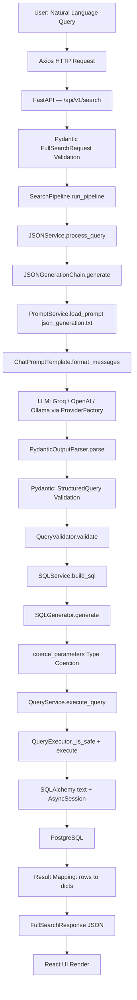

# AskDB — AI Pipeline Engineering Guide

> **Audience:** Software Engineers, Technical Architects, and anyone needing to understand or present the complete internal mechanics of how AskDB converts Natural Language to SQL.
>
> **Scope:** This is an engineering guide, not a README, API reference, or user tutorial. It explains the internals.

---

# Chapter 1 — Complete AI Pipeline Overview

## 1.1 Pipeline Summary

AskDB's core promise — "speak in English, get database results" — is implemented by a strict, multi-stage pipeline. Each stage has one well-defined responsibility, and no stage is trusted to skip validation. The pipeline is designed so the **LLM never writes SQL**. Instead, the LLM writes a structured data description (JSON), and AskDB's own deterministic Python engine compiles that into safe, parameterized SQL.

## 1.2 Pipeline Flow Diagram



## 1.3 Component Roles at a Glance

| Stage | File | Class / Function | Role |
| :--- | :--- | :--- | :--- |
| HTTP Entry | `endpoints/search.py` | `full_search()` | Receives HTTP POST, validates Pydantic model |
| Orchestration | `services/search/search_pipeline.py` | `SearchPipeline` | Runs all stages in sequence, saves history |
| NL → JSON | `services/ai/json_service.py` | `JSONService` | Thin wrapper that delegates to the LangChain chain |
| LangChain Core | `ai/chains/json_chain.py` | `JSONGenerationChain` | Builds prompt, calls LLM, parses & validates output |
| Prompt Loading | `services/ai/prompt_service.py` | `PromptService` | Reads `json_generation.txt` from disk |
| LLM Routing | `core/providers/factory.py` | `ProviderFactory` | Singleton that creates Groq/OpenAI/Ollama clients |
| Schema Validation | `query_builder/query_validator.py` | `QueryValidator` | Validates table names and columns against real schema |
| JSON → SQL | `services/search/sql_service.py` | `SQLService` | Delegates JSON-to-SQL via SQLGenerator |
| SQL Compilation | `query_builder/sql_generator.py` | `SQLGenerator` | Deterministic compiler: StructuredQuery → parameterized SQL |
| Type Coercion | `query_builder/param_coercion.py` | `coerce_parameters()` | Converts LLM string values to proper Python types |
| Execution | `services/search/query_service.py` | `QueryService` | Times and delegates to QueryExecutor |
| Safety Guard | `query_builder/query_executor.py` | `QueryExecutor` | Regex-blocks dangerous SQL; runs via SQLAlchemy |
| DB Driver | `database/session.py` | `async_session_maker` | Provides AsyncSession connected to PostgreSQL via asyncpg |

---

> **📣 Presenter Script — Chapter 1:**
> "AskDB's pipeline is a one-way assembly line. A natural language string enters at the top. It passes through strict validation gates at every stage. The LLM never touches SQL. Instead, it produces a structured JSON object that AskDB's own code compiles into parameterized SQL. If anything fails, the pipeline stops and the error is logged and re-raised — never silently swallowed."

---

# Chapter 2 — Natural Language → Structured JSON

## Tracing the query: `"Show all employees hired after 2024"`

---

### Step 1 — User Enters the Query (React Frontend)

The user types the query into the AskDB search interface. The React frontend holds this as local component state. When submitted, the frontend calls its API layer using **Axios**.

**File:** `frontend/src/services/search.service.ts`

The call is roughly:
```typescript
const response = await axios.post<SearchResponse>(
  `${API_URL}/api/v1/search`,
  { query: "Show all employees hired after 2024" }
);
```

- **Input:** A raw string from the user.
- **Output:** An HTTP `POST` request with a JSON body `{ "query": "Show all employees hired after 2024" }`.
- Axios automatically sets `Content-Type: application/json` and serializes the JavaScript object to JSON.

---

### Step 2 — FastAPI Receives the Request

**File:** `backend/app/api/v1/endpoints/search.py`

The request lands on the `/api/v1/search` endpoint, implemented as a `POST` route:

```python
class FullSearchRequest(BaseModel):   # Line 46
    query: str

class FullSearchResponse(BaseModel):  # Line 49
    success: bool
    question: str | None = None
    structured_json: dict | None = None
    generated_sql: str | None = None
    parameters: dict | None = None
    execution_time_ms: int = 0
    row_count: int = 0
    columns: list[str] = []
    rows: list[dict] = []
    error: str | None = None

@router.post("", response_model=FullSearchResponse)   # Line 77
async def full_search(
    request: FullSearchRequest,
    pipeline: SearchPipeline = Depends(get_search_pipeline),
    db: AsyncSession = Depends(get_db)
):
    try:
        result = await pipeline.run_pipeline(db, request.query)
        return FullSearchResponse(**result)
    except Exception as e:
        logger.exception(f"Search API Error (Full Pipeline): {str(e)}", exc_info=e)
        raise HTTPException(status_code=400, detail=str(e))
```

**Line-by-line breakdown:**

- `class FullSearchRequest(BaseModel)`: When the JSON body arrives, FastAPI automatically deserializes the JSON and validates it against this Pydantic model. If the body is missing `query` or it's not a string, FastAPI immediately returns HTTP 422 and never calls the function.
- `@router.post("", response_model=FullSearchResponse)`: Registers the route. The `response_model` tells FastAPI to auto-serialize the return value and to only expose the declared fields, never accidental data.
- `pipeline: SearchPipeline = Depends(get_search_pipeline)`: FastAPI's Dependency Injection creates the `SearchPipeline` instance per request.
- `db: AsyncSession = Depends(get_db)`: Similarly injects a fresh `AsyncSession` scoped to this single request. Defined in `database/session.py`.
- `result = await pipeline.run_pipeline(db, request.query)`: This is the single critical call. Everything else in this function is just marshalling.
- `return FullSearchResponse(**result)`: The raw dict from the pipeline is unpacked into the response model. Pydantic validates once more before the response is sent.
- `raise HTTPException(status_code=400, detail=str(e))`: Any pipeline error (LLM failure, validation failure, DB error) is caught here and converted to a standard HTTP 400 response.

---

### Step 3 — SearchPipeline Orchestrates the Stages

**File:** `backend/app/services/search/search_pipeline.py`  
**Class:** `SearchPipeline`  
**Method:** `run_pipeline`

`SearchPipeline` is the conductor. It knows the sequence of operations but delegates every step to a specialized service. It does not contain AI logic, SQL logic, or database logic directly.

```python
class SearchPipeline:
    def __init__(self):
        self.json_service = JSONService()    # Handles NL → StructuredQuery
        self.sql_service = SQLService()      # Handles StructuredQuery → SQL
        self.query_service = QueryService()  # Handles SQL → Results

    async def run_pipeline(self, session: AsyncSession, natural_language: str) -> Dict[str, Any]:
        pipeline_start = time.perf_counter()

        # 1. Natural Language → Structured JSON
        structured_query = await self.json_service.process_query(natural_language)
        structured_json = structured_query.model_dump()

        # 2. Structured JSON → Parameterized SQL
        sql, parameters = self.sql_service.build_sql(structured_json)

        # 3. SQL Execution → Results
        db_result = await self.query_service.execute_query(session, sql, parameters)

        # ... construct and return the final response dict
```

**Why does `SearchPipeline` exist?**

Without it, the FastAPI endpoint would have to know about LangChain, SQLAlchemy, Pydantic models, and timing logic. This violates the Single Responsibility Principle. `SearchPipeline` is the only class that knows the *order* of operations; each service knows only its own step.

**The `finally` block** (line 87–103) is critical: it saves the search history regardless of whether the pipeline succeeded or failed. This is intentional — failed queries are still worth logging for debugging and analytics.

---

### Step 4 — JSONService Calls the LangChain Chain

**File:** `backend/app/services/ai/json_service.py`  
**Class:** `JSONService`  
**Method:** `process_query`

```python
class JSONService:
    def __init__(self):
        self.chain = JSONGenerationChain()  # Creates the full LangChain pipeline

    async def process_query(self, query: str) -> StructuredQuery:
        start_time = time.time()
        result = await self.chain.generate(query)  # The actual LLM call
        execution_time = time.time() - start_time
        logger.info(f"JSON generated successfully in {execution_time:.2f}s")
        return result
```

`JSONService` is a thin façade over `JSONGenerationChain`. Its purpose is separation: if you ever want to replace LangChain with a different AI framework, you only modify `JSONGenerationChain` — `JSONService` and everything above it remains unchanged.

- **Input:** `query: str` — the raw natural language string.
- **Output:** `StructuredQuery` — a fully validated Pydantic object.

---

### Step 5 — LangChain: JSONGenerationChain Deep Dive

**File:** `backend/app/ai/chains/json_chain.py`  
**Class:** `JSONGenerationChain`

#### What is LangChain?

LangChain is an open-source Python framework that standardizes how you build applications on top of Large Language Models. It was created because directly using LLM provider SDKs (Groq SDK, OpenAI SDK, etc.) leads to brittle, vendor-locked code. LangChain solves this with a universal abstraction layer.

**Core insight:** Every LLM interaction follows the same pattern: `Prompt → LLM → Parse Output`. LangChain formalizes this pattern with reusable, swappable components.

**In AskDB, these LangChain components are used:**

---

#### Component A: `ChatPromptTemplate`

**What it is:** A template engine for LLM prompts. Instead of f-strings, it provides a typed, testable way to construct multi-part messages with variable placeholders.

**Import:** `from langchain_core.prompts import ChatPromptTemplate`

```python
# In JSONGenerationChain.generate():
prompt_text = self.prompt_service.load_prompt("json_generation.txt")
prompt_template = ChatPromptTemplate.from_template(prompt_text)

messages = prompt_template.format_messages(
    schema_info=self.schema_info,
    query=natural_language,
    format_instructions=self.parser.get_format_instructions()
)
```

- `ChatPromptTemplate.from_template(prompt_text)`: Parses `json_generation.txt` and identifies all `{placeholders}`.
- `.format_messages(...)`: Replaces `{schema_info}`, `{query}`, and `{format_instructions}` with the actual values. The result is a list of `HumanMessage` objects ready to be sent to the LLM.

**Why not use a plain f-string?**  
`ChatPromptTemplate` validates that all placeholders are provided, works with any LangChain-compatible LLM, and generates `format_instructions` automatically from the Pydantic schema.

---

#### Component B: `PydanticOutputParser`

**What it is:** A LangChain parser that takes an LLM's raw text output and converts it into a typed Pydantic object.

**Import:** `from langchain_core.output_parsers import PydanticOutputParser`

```python
# In JSONGenerationChain.__init__():
self.parser = PydanticOutputParser(pydantic_object=StructuredQuery)
```

**Two functions it performs:**

1. **Prompt augmentation (`get_format_instructions()`):** Inspects the `StructuredQuery` class and its `Field(description=...)` annotations to generate a JSON schema string. This string is injected into the prompt via `{format_instructions}`. The LLM receives instructions like: *"Return a JSON object with the following fields: table (string), columns (list of strings), ..."*

2. **Parsing (`parse(response.content)`):** Takes the LLM's raw text (which might contain markdown code fences like ` ```json...``` `), strips the fences, and calls `StructuredQuery.model_validate_json()` on the clean string. If it fails, it raises `OutputParserException`.

```python
response = await self.llm.ainvoke(messages)  # Raw text from LLM
structured_query = self.parser.parse(response.content)  # → StructuredQuery object
```

---

#### Component C: `BaseChatModel` (Groq / OpenAI / Ollama via ProviderFactory)

**Import:** `from langchain_core.language_models.chat_models import BaseChatModel`

AskDB never imports `ChatGroq` or `ChatOpenAI` directly into the chain. Instead:

```python
# In JSONGenerationChain.__init__():
self.llm = get_llm()  # Returns BaseChatModel from ProviderFactory
```

**`get_llm()`** (`core/llm.py`) delegates to `ProviderFactory.get_instance().get_llm()`.

**`ProviderFactory`** (`core/providers/factory.py`) is a Singleton that builds and caches the active LLM provider. It maps provider names to classes:

```python
_CLOUD_PROVIDERS = {
    "groq":       GroqProvider,
    "openai":     OpenAIProvider,
    "gemini":     GeminiProvider,
    "anthropic":  AnthropicProvider,
    "openrouter": OpenRouterProvider,
}
```

The user-selected provider (from the frontend's LLM settings panel) triggers `factory.configure(source=..., provider=..., model=..., api_key=...)`, which invalidates the cached `_provider` instance. The next call to `get_llm()` rebuilds it with the new settings.

Every provider ultimately returns a `BaseChatModel` instance, which is the only interface `JSONGenerationChain` ever sees. This is the **Strategy Pattern** — the chain never needs to know whether it's talking to Groq, OpenAI, or Ollama.

---

#### Component D: `@retry` from Tenacity

```python
@retry(wait=wait_exponential(multiplier=1, min=2, max=10), stop=stop_after_attempt(3))
async def generate(self, natural_language: str) -> StructuredQuery:
```

LLMs are non-deterministic. Sometimes they produce malformed JSON. The `@retry` decorator automatically re-calls `generate()` if a `ValueError` is raised (from parsing failure or validation failure), with exponential backoff: waits 2s, then 4s, then 8s, before giving up after 3 attempts.

---

#### Schema Extraction at `__init__` Time

```python
# In JSONGenerationChain.__init__():
schema_lines = []
for table_name, table in Base.metadata.tables.items():
    col_strs = []
    for col in table.columns:
        if hasattr(col.type, 'enums') and col.type.enums:
            col_strs.append(f"{col.name}[{'|'.join(col.type.enums)}]")
        else:
            col_strs.append(col.name)
    cols = ", ".join(col_strs)
    pks = ", ".join([col.name for col in table.primary_key.columns])
    fks = [f"{fk.parent.name} -> {fk.column.table.name}.{fk.column.name}"
           for fk in table.foreign_keys]
    schema_lines.append(f"- {table_name}: {cols}")
    if pks: schema_lines.append(f"  Primary Keys: {pks}")
    if fks: schema_lines.append(f"  Foreign Keys: {', '.join(fks)}")
self.schema_info = "\n".join(schema_lines)
```

This walks SQLAlchemy's `Base.metadata` (the in-memory registry of all ORM models) to produce a compact text representation of the database schema — including column names, enum values, primary keys, and foreign key relationships. This `schema_info` string is injected into every LLM prompt, grounding the LLM in the actual database structure.

---

### Step 6 — Prompt Engineering

**File:** `backend/app/prompts/json_generation.txt`

```text
You are an expert PostgreSQL database analyst.
Your task is to convert the user's natural language question into a structured JSON query object.

AVAILABLE TABLES & COLUMNS:
{schema_info}

RULES:
1. "table" must be a single valid table name from the list above.
2. "joins" must explicitly list any joined tables using the foreign keys provided. Example: {"table": "departments", "on": "employees.department_id = departments.id"}. Do NOT use aliases in the ON clause, use full table names.
3. "columns" must be a list of valid column names. Use `table.column` format if joins are used (e.g., `employees.name`).
4. "filters" contains filtering conditions. Optionally include "table" to qualify the field. Operators must be =, !=, >, <, >=, <=, LIKE, IN, BETWEEN.
5. "sort" handles ORDER BY logic (asc or desc). Optionally include "table".
6. "group_by" handles aggregations. Use `table.column` if joins are used.
7. Limit defaults to 50 unless specified otherwise.
8. Only use the fields specified in the schema. Do not hallucinate fields.
9. NEVER assume a table has an "id" column. Use the "Primary Keys" provided in the schema for joins or aggregations.

USER QUESTION:
{query}

Generate the JSON query structure based ONLY on the schemas provided.

{format_instructions}
```

**Annotation of every section:**

| Section | Why it exists |
| :--- | :--- |
| **Role assignment** ("You are an expert...") | Sets the LLM's persona. This dramatically improves the quality of structured output compared to an unset persona. |
| `{schema_info}` | Grounds the LLM. Without this, the LLM would hallucinate table and column names. |
| **RULES 1-9** | Each rule addresses a known LLM failure mode. Rule 9 prevents the LLM from inventing an "id" column that may not exist in all tables. |
| `{query}` | The actual user question, injected at runtime. |
| `{format_instructions}` | Auto-generated by `PydanticOutputParser.get_format_instructions()`. Contains the exact JSON schema the output must follow, derived from `StructuredQuery`'s field definitions. |

---

### Step 7 — LLM Request: What Happens During `ainvoke()`

```python
response = await self.llm.ainvoke(messages)
```

Regardless of which provider is active, this call follows the same path:

1. **Serialization:** The `messages` list (a `HumanMessage` object) is serialized to the provider's JSON format (e.g., `{"messages": [{"role": "user", "content": "..."}]}`).
2. **HTTP Request:** The LangChain provider wrapper (e.g., `ChatGroq`) sends an HTTPS `POST` to the provider API (e.g., `https://api.groq.com/openai/v1/chat/completions`).
3. **Inference:** The provider runs the prompt through the LLM. For Groq, this happens on dedicated LPU (Language Processing Unit) hardware.
4. **Response:** The provider returns a JSON object. LangChain extracts the `content` field from the first choice.
5. **`AIMessage`:** LangChain wraps the content in an `AIMessage` object. `response.content` is the raw text.

`ainvoke()` is the **async** version of `invoke()`. Since AskDB is async-first (FastAPI + asyncpg), using `ainvoke()` means the server thread is not blocked while waiting for the LLM. Other requests can be processed during this wait.

---

### Step 8 — PydanticOutputParser: Converting Raw Text to Structure

```python
structured_query = self.parser.parse(response.content)
```

**What the raw response looks like:**
```
```json
{
  "table": "employees",
  "columns": ["name", "hire_date"],
  "filters": [{"field": "hire_date", "operator": ">=", "value": "2025-01-01"}],
  "limit": 50
}
```
```

**What `parser.parse()` does:**
1. Strips markdown code fences (` ```json ... ``` `).
2. Calls `json.loads()` on the remaining string.
3. Calls `StructuredQuery.model_validate(parsed_dict)`.
4. If validation passes, returns a fully-typed `StructuredQuery` object.
5. If validation fails, raises `OutputParserException` — which triggers the `@retry` decorator.

---

### Step 9 — Pydantic Validation: The Safety Gate

**File:** `backend/app/ai/structured_output/schemas.py`

```python
class OperatorEnum(str, Enum):
    EQ = "="
    NEQ = "!="
    GT = ">"
    LT = "<"
    GTE = ">="
    LTE = "<="
    LIKE = "LIKE"
    IN = "IN"
    BETWEEN = "BETWEEN"
    IS_NULL = "IS NULL"
    IS_NOT_NULL = "IS NOT NULL"

class FilterCondition(BaseModel):
    table: Optional[str] = Field(default=None, description="The table this field belongs to")
    field: str = Field(description="The column name to filter on")
    operator: OperatorEnum = Field(description="The comparison operator")
    value: str | int | float | list[str] | list[int] | list[float] | None = Field(...)

class StructuredQuery(BaseModel):
    table: str = Field(description="The primary table to query from")
    joins: Optional[List[JoinCondition]] = Field(default=None, ...)
    columns: List[str] = Field(description="List of columns to select...")
    filters: Optional[List[FilterCondition]] = Field(default=None, ...)
    sort: Optional[SortCondition] = Field(default=None, ...)
    group_by: Optional[List[str]] = Field(default=None, ...)
    limit: Optional[int] = Field(default=50, ...)
    offset: Optional[int] = Field(default=0, ...)
```

**Why this schema design is the critical security layer:**

- **`OperatorEnum`:** The LLM cannot produce the SQL operator `DROP TABLE` or `; DELETE FROM`. The only valid operator values are the ten entries in the enum. If the LLM produces anything else, Pydantic raises `ValidationError` immediately.
- **`Field(description=...)`:** These descriptions are not just comments. They are read by `PydanticOutputParser` and injected into the LLM's format instructions, steering the LLM toward correct output.
- **`limit: Optional[int] = Field(default=50)`:** Even if the LLM omits `limit`, Pydantic sets it to 50. This is an automatic safeguard against returning millions of rows.
- **`model_dump()`:** Called in `SearchPipeline` to convert the validated object back to a standard Python dict for logging and the API response.

---

### Step 10 — QueryValidator: Schema-Level Verification

After `PydanticOutputParser` validates the *structure* (correct field types), `QueryValidator.validate()` validates the *content* (do those tables and columns actually exist?).

**File:** `backend/app/query_builder/query_validator.py`

```python
class QueryValidator:
    def __init__(self):
        self.schema = {}
        for table_name, table in Base.metadata.tables.items():
            self.schema[table_name] = [col.name for col in table.columns]

    def validate(self, query: StructuredQuery) -> bool:
        if query.table not in self.schema:
            raise ValueError(f"Table '{query.table}' does not exist.")
        # ... validates joined tables, columns, filter fields, sort field
```

This walks the `StructuredQuery` and checks every table name and column name against the live SQLAlchemy metadata. If the LLM hallucinated a column called `employee_full_name` that doesn't exist, `QueryValidator` catches it and raises a `ValueError` which triggers `@retry`.

---

### Step 11 — Final Structured JSON

For the query `"Show all employees hired after 2024"`, the final `StructuredQuery.model_dump()` output is:

```json
{
  "table": "employees",
  "joins": null,
  "columns": ["name", "hire_date"],
  "filters": [
    {
      "table": null,
      "field": "hire_date",
      "operator": ">=",
      "value": "2025-01-01"
    }
  ],
  "sort": null,
  "group_by": null,
  "limit": 50,
  "offset": 0
}
```

**Every field explained:**

| Field | Value | Why |
| :--- | :--- | :--- |
| `table` | `"employees"` | The LLM correctly identified the primary table. |
| `joins` | `null` | No cross-table join was needed. |
| `columns` | `["name", "hire_date"]` | LLM selected relevant columns from the schema. |
| `filters` | `[{...}]` | `hire_date >= '2025-01-01'` (LLM interpreted "after 2024" as ≥ 2025-01-01). |
| `sort` | `null` | User didn't specify ordering. |
| `group_by` | `null` | No aggregation needed. |
| `limit` | `50` | Pydantic default. |
| `offset` | `0` | Start from the beginning. |

---

> **📣 Presenter Script — Chapter 2:**
> "The most important thing to understand is that the LLM's job is narrow: it produces a JSON object, nothing more. The user's query enters FastAPI, which validates the shape of the HTTP request. Then SearchPipeline takes over. It delegates to JSONService, which delegates to JSONGenerationChain. Inside the chain, LangChain's ChatPromptTemplate stitches together the user's question, the actual database schema, and precise JSON formatting instructions. This full prompt is sent to the LLM. The LLM responds with JSON text. PydanticOutputParser converts that text to a StructuredQuery Python object. Before moving forward, QueryValidator checks that every table and column in that object actually exists in the database. Only after passing all these gates does the pipeline proceed to SQL generation."

---

# Chapter 3 — Structured JSON → SQL

## Why AskDB Does NOT Generate SQL Directly

A natural question is: *Why not just ask the LLM to write the SQL?*

This table summarizes why the JSON-first approach was chosen:

| Dimension | Direct SQL from LLM | JSON AST → Compiled SQL (AskDB's approach) |
| :--- | :--- | :--- |
| **SQL Injection risk** | HIGH — LLM can hallucinate `; DROP TABLE` | ZERO — values are always bind parameters |
| **Determinism** | Low — SQL output format varies per call | High — our compiler always produces the same SQL for the same JSON |
| **Testability** | Cannot easily unit-test LLM SQL output | `SQLGenerator.generate()` is a pure function, trivially testable |
| **Operator control** | LLM can use any operator, including destructive | `OperatorEnum` limits operators to 10 safe values |
| **Type safety** | LLM embeds values as strings in SQL | `coerce_parameters()` converts to correct Python types |

The JSON AST is an intermediate representation — a safe, abstract description of the query intent that AskDB controls fully.

---

## The SQLGenerator

**File:** `backend/app/query_builder/sql_generator.py`  
**Class:** `SQLGenerator`  
**Method:** `generate(query: StructuredQuery) -> Tuple[str, Dict[str, Any]]`

### SELECT Clause

```python
columns_str = ", ".join(query.columns) if query.columns else "*"
sql_parts.append(f"SELECT\n    {columns_str}")
```

For our example: `SELECT\n    name, hire_date`

### FROM Clause

```python
sql_parts.append(f"FROM {query.table}")
```

Output: `FROM employees`

### JOIN Clause

```python
if query.joins:
    for join in query.joins:
        sql_parts.append(f"JOIN {join.table} ON {join.on}")
```

Skipped in our example (`joins` is null).

### WHERE Clause (The Critical Security Section)

```python
if query.filters:
    where_clauses = []
    for f in query.filters:
        qual_field = f"{f.table}.{f.field}" if f.table else f.field
        param_name = f"{f.field.replace('(', '').replace(')', '')}_{param_counter}"
        op = f.operator.value

        if op in ("IS NULL", "IS NOT NULL"):
            where_clauses.append(f"{qual_field} {op}")          # No parameter needed
        elif op == "BETWEEN":
            where_clauses.append(f"{qual_field} BETWEEN :{param_name_1} AND :{param_name_2}")
            parameters[param_name_1] = f.value[0]
            parameters[param_name_2] = f.value[1]
        elif op == "IN":
            in_params = [f":{param_name}_{idx}" for idx, val in enumerate(f.value)]
            parameters[...] = val
            where_clauses.append(f"{qual_field} IN ({', '.join(in_params)})")
        else:
            where_clauses.append(f"{qual_field} {op} :{param_name}")  # ← BIND PARAM
            parameters[param_name] = f.value
```

**For our example:**
- `qual_field` = `hire_date`
- `op` = `>=`
- `param_name` = `hire_date_1`
- Appends: `hire_date >= :hire_date_1`
- `parameters["hire_date_1"]` = `"2025-01-01"` (the actual value, never in the SQL string)

**Why `:param_name` syntax?** This is SQLAlchemy's named bind parameter format. When executed via `text(sql)`, SQLAlchemy passes the `parameters` dict to `asyncpg`, which uses the binary PostgreSQL protocol to bind the values. The value `"2025-01-01"` is **never** interpolated into the SQL string — it is transmitted as a separate, typed byte stream. This is the exact mechanism that makes SQL injection impossible.

### ORDER BY

```python
if query.sort:
    direction = query.sort.direction.upper()
    if direction not in ("ASC", "DESC"):
        direction = "ASC"  # Safety fallback
    sql_parts.append(f"ORDER BY {qual_sort_field} {direction}")
```

Note the `if direction not in ("ASC", "DESC")` guard — even if the LLM somehow passed `"DROP TABLE"` as the sort direction, it would be silently replaced with `"ASC"`.

### LIMIT / OFFSET

```python
if query.limit is not None:
    sql_parts.append(f"LIMIT {query.limit}")      # Integer, safe
if query.offset is not None and query.offset > 0:
    sql_parts.append(f"OFFSET {query.offset}")    # Integer, safe
```

`limit` and `offset` are Pydantic-validated integers, so they are directly interpolated (safe for numeric types).

### Type Coercion: `coerce_parameters()`

**File:** `backend/app/query_builder/param_coercion.py`

After `SQLGenerator` produces the `parameters` dict, it calls `coerce_parameters()`:

```python
parameters = coerce_parameters(query.table, parameters, param_field_map)
```

The LLM returns values as strings (e.g., `"2025-01-01"` for a date column). PostgreSQL's binary protocol requires proper Python types. This function:

1. Builds a `_COLUMN_TYPE_MAP` from SQLAlchemy metadata (maps `(table, column)` → SQLAlchemy type).
2. For each parameter, looks up the column type.
3. Coerces the value — e.g., `"2025-01-01"` → `datetime.date(2025, 1, 1)` for a `Date` column.

Supported coercions: `Date`, `DateTime`, `UUID`, `Integer`, `Numeric/Float`, `Boolean`, `Enum`, and passthrough for `String/Text`.

### Final SQL for Our Example

```sql
SELECT
    name, hire_date
FROM employees
WHERE hire_date >= :hire_date_1
LIMIT 50;
```

With parameters: `{"hire_date_1": datetime.date(2025, 1, 1)}`

---

> **📣 Presenter Script — Chapter 3:**
> "Once we have the validated StructuredQuery object, we pass it to SQLGenerator. This is a pure Python function — no LLM involvement. It walks the StructuredQuery field by field and assembles a SQL string. The critical point is that user-provided values, which ultimately came from the LLM, are never written into the SQL string itself. Instead, they are placed in a separate parameters dictionary as bind parameters using the :colon syntax. SQLAlchemy then sends these as a separate binary payload to PostgreSQL. This is the standard industry method for preventing SQL injection."

---

# Chapter 4 — SQL Execution

## QueryExecutor: Safety + Execution

**File:** `backend/app/query_builder/query_executor.py`  
**Class:** `QueryExecutor`

Before any SQL touches the database, `QueryExecutor._is_safe()` runs a final defense layer:

```python
FORBIDDEN_KEYWORDS = re.compile(
    r'\b(INSERT|UPDATE|DELETE|DROP|ALTER|TRUNCATE|CREATE|REPLACE|MERGE|GRANT|REVOKE|EXEC|EXECUTE)\b',
    re.IGNORECASE
)

def _is_safe(self, sql: str) -> bool:
    cleaned_sql = sql.strip().upper()
    if not cleaned_sql.startswith("SELECT"):     # Must start with SELECT
        return False
    if ';' in sql.strip()[:-1]:                  # No multi-statement injection
        return False
    if self.FORBIDDEN_KEYWORDS.search(sql):      # No DDL/DML keywords
        return False
    return True
```

This is a defense-in-depth measure. Even if the `StructuredQuery` validation and `SQLGenerator` are somehow compromised, this regex provides a final gate.

## Execution via SQLAlchemy and asyncpg

```python
async def execute(self, session: AsyncSession, sql: str, parameters: Dict[str, Any]) -> List[Dict]:
    if not self._is_safe(sql):
        raise ValueError("Unsafe SQL query detected. Only SELECT statements are allowed.")

    statement = text(sql)                         # Wrap in SQLAlchemy text()
    result = await session.execute(statement, parameters)  # Async execution
    rows = result.mappings().all()                # Get rows as Mapping objects
    return [dict(row) for row in rows]            # Convert to plain dicts
```

**`text(sql)`:** SQLAlchemy's `text()` construct accepts a raw SQL string with `:param` placeholders. It is NOT ORM-based. It treats the SQL as a parameterized statement.

**`await session.execute(statement, parameters)`:** This is the async call. SQLAlchemy passes the statement and the parameters dictionary to `asyncpg` through its async engine. `asyncpg` uses PostgreSQL's Extended Query Protocol: it sends the SQL and parameters as separate binary messages, not as a concatenated string.

**`result.mappings().all()`:** The result from the database is a set of rows. `.mappings()` converts each row to an `RowMapping` object (similar to a dict). `.all()` fetches all rows into memory.

**`[dict(row) for row in rows]`:** Converts each `RowMapping` to a plain Python `dict`. Column names become keys. These dicts are JSON-serializable and are returned up the call stack to the API response.

## Database Session Management

**File:** `backend/app/database/session.py`

```python
async_session_maker = async_sessionmaker(
    engine, class_=AsyncSession, expire_on_commit=False, autoflush=False
)

async def get_db() -> AsyncGenerator[AsyncSession, None]:
    async with async_session_maker() as session:
        try:
            yield session
        finally:
            await session.close()
```

**`create_async_engine`** (`connection.py`): Creates the async engine with `asyncpg` as the driver. `pool_size=5, max_overflow=10` means up to 15 concurrent database connections before the next request queues up.

**`async_sessionmaker`**: A factory that creates `AsyncSession` instances. `expire_on_commit=False` is critical for async code — it prevents SQLAlchemy from invalidating Python objects after a commit.

**`get_db()`**: A FastAPI dependency generator. The `yield` pattern ensures the session is always closed, even if an exception occurs during request processing.

---

> **📣 Presenter Script — Chapter 4:**
> "SQL execution has two layers of protection. First, QueryExecutor runs a regex against the SQL string. If it doesn't start with SELECT, or if it contains keywords like DROP, DELETE, or INSERT, it is immediately rejected. Second, the actual execution uses SQLAlchemy's async session, which sends the SQL and its parameters as separate binary messages to PostgreSQL via the asyncpg driver. The query result is a set of rows that we convert to plain Python dictionaries, which FastAPI serializes as JSON back to the React frontend."

---

# Chapter 5 — Complete Data Transformation

The following traces every single transformation from user input to React UI render:

| Stage | What exists | Transformation applied |
| :--- | :--- | :--- |
| **User Input** | `"Show all employees hired after 2024"` | User types |
| **Axios Body** | `{ "query": "Show all employees hired after 2024" }` | Axios serializes to JSON |
| **Pydantic Validation** | `FullSearchRequest(query="Show all employees hired after 2024")` | FastAPI validates via Pydantic |
| **Prompt Template** | `ChatPromptTemplate` with `{schema_info}`, `{query}`, `{format_instructions}` | PromptService loads template |
| **Rendered Prompt** | Full text string combining schema, rules, user query, and JSON schema instructions | `format_messages()` fills placeholders |
| **LLM Request** | HTTPS POST to Groq (or other provider) with serialized messages | LangChain `ainvoke()` |
| **Raw LLM Response** | A markdown-fenced JSON string | Provider returns text completion |
| **Parsed Dict** | `{"table": "employees", "columns": [...], "filters": [...], ...}` | `PydanticOutputParser.parse()` strips fences and `json.loads()` |
| **StructuredQuery Object** | Typed Python object with validated fields, `OperatorEnum` enforced | `StructuredQuery.model_validate()` |
| **Schema Validation** | Same object, confirmed to have real tables/columns | `QueryValidator.validate()` |
| **Parameterized SQL** | `"SELECT\n    name, hire_date\nFROM employees\nWHERE hire_date >= :hire_date_1\nLIMIT 50;"` | `SQLGenerator.generate()` |
| **Coerced Parameters** | `{"hire_date_1": datetime.date(2025, 1, 1)}` | `coerce_parameters()` |
| **Safety Check** | Boolean `True` | `QueryExecutor._is_safe()` |
| **Database Rows** | PostgreSQL binary result set | `asyncpg` executes via Extended Query Protocol |
| **Python Dicts** | `[{"name": "Alice", "hire_date": date(2025, 3, 15)}, ...]` | `result.mappings().all()` + list comprehension |
| **JSON Response** | `{"success": true, "rows": [...], "columns": [...], ...}` | FastAPI serializes `FullSearchResponse` |
| **React State** | TanStack Query cache updated | Axios resolves Promise |
| **React UI** | Data table rendered | React re-render |

---

# Chapter 6 — Library Deep Dive

## FastAPI

**Part 1 — General:**  
FastAPI is an ASGI web framework for Python built on top of Starlette (for routing) and Pydantic (for validation). It was created by Sebastián Ramírez to solve the twin problems of Django (too slow, synchronous) and Flask (no type safety, no auto-validation). Internally, when a request arrives, FastAPI reads the function signature, identifies which parameters come from the body/path/query/headers, and uses Pydantic to parse and validate them before calling the function. If validation fails, FastAPI returns HTTP 422 — the function is never called. OpenAPI documentation is generated automatically by reading these type annotations.

**Part 2 — In AskDB:**  
FastAPI is used for all HTTP routing. The Dependency Injection system (`Depends()`) is used to inject `SearchPipeline`, `JSONService`, `SQLService`, `QueryService`, and `AsyncSession` into endpoint functions without those functions needing to construct these objects. The `response_model=FullSearchResponse` on every endpoint ensures that the function's return value is validated before serialization, preventing accidental data leakage.

---

## LangChain

**Part 1 — General:**  
LangChain is an LLM application framework. Its fundamental insight is that every LLM application is a composition of: *Prompts + LLMs + Output Parsers*. By standardizing these as composable objects with a uniform interface (`Runnable`), LangChain allows you to swap any component without rewriting the rest. The LCEL (LangChain Expression Language) allows chaining: `prompt | llm | parser`.

**Part 2 — In AskDB:**  
AskDB uses `ChatPromptTemplate` for prompt construction, `PydanticOutputParser` for structured output parsing, and `BaseChatModel` as the universal interface to all LLM providers. The chain does not use LCEL's `|` operator — it calls each step explicitly for better error handling and logging. LangChain's provider wrappers (`langchain_groq`, `langchain_openai`, etc.) are used inside the provider classes to avoid SDK-level code duplication.

---

## Pydantic

**Part 1 — General:**  
Pydantic is a Python data validation library that enforces type annotations at runtime. When data is passed to a `BaseModel`, it is coerced and validated immediately. `ValidationError` is raised if any field fails. It was created to bring TypeScript-like type safety to Python APIs. Version 2 (used by AskDB) is rewritten in Rust (via `pydantic-core`), making validation orders of magnitude faster than v1.

**Part 2 — In AskDB:**  
Pydantic has three distinct roles. First, as the **HTTP schema** (`FullSearchRequest`, `FullSearchResponse`) — defining what the API accepts and returns. Second, as the **LLM output schema** (`StructuredQuery`, `FilterCondition`, `OperatorEnum`) — defining the exact structure the LLM must produce. Third, as the **configuration schema** (`LLMSettings`) via `pydantic-settings`, which reads environment variables into typed Python attributes.

---

## SQLAlchemy

**Part 1 — General:**  
SQLAlchemy is a SQL toolkit and ORM for Python. It has two layers: the Core (raw SQL expression language) and the ORM (object-relational mapper). Version 2.0 (used by AskDB) added native async support. Internally, SQLAlchemy separates the dialect (PostgreSQL/MySQL/SQLite syntax), the engine (connection pooling), and the session (unit of work). It does not write queries — it provides tools to write them safely.

**Part 2 — In AskDB:**  
AskDB uses SQLAlchemy in two modes. The ORM is used only for the internal application database (users, history, connections) — using `Base.metadata` for schema introspection and Alembic migrations. The Core `text()` construct is used for executing user-generated queries, specifically because the queries are fully dynamic and can't be expressed with ORM constructs.

---

## asyncpg

**Part 1 — General:**  
`asyncpg` is a Python database driver for PostgreSQL that implements the PostgreSQL binary wire protocol directly in Python/Cython, without the C library `libpq`. It was created specifically for asyncio and is 3-5x faster than `psycopg2` for concurrent workloads because it avoids thread context-switching.

**Part 2 — In AskDB:**  
`asyncpg` is the underlying driver behind SQLAlchemy's `create_async_engine`. AskDB never calls `asyncpg` directly — it is invoked by SQLAlchemy when `await session.execute()` is called. The critical benefit is that the FastAPI server thread is never blocked while waiting for PostgreSQL to respond. During a database query, the event loop can serve other incoming HTTP requests.

---

## Zustand (Frontend)

**Part 1 — General:**  
Zustand is a minimal state management library for React. Unlike Redux, it requires no providers, reducers, or action creators. A store is a single function call, and state is updated by calling `set()` directly. It integrates with React's `useSyncExternalStore` for optimal re-render performance.

**Part 2 — In AskDB:**  
Zustand manages the LLM settings (provider, model, API key) and stores them in `localStorage` via the `persist` middleware. A key privacy feature: the `partialize` option strips the `apiKey` from `localStorage` unless the user has checked `rememberKey`. This prevents API keys from being stored on disk without explicit user consent.

---

> **📣 Presenter Script — Chapter 6:**
> "Every library in AskDB was chosen for a specific engineering reason, not familiarity. FastAPI for its async-first design. LangChain so we can switch LLM providers without rewriting the pipeline. Pydantic because it's the only way to validate LLM output reliably at runtime. SQLAlchemy for safe parameterized queries. asyncpg so the server never blocks on database I/O."

---

# Chapter 7 — Technical Interview Questions

### Q1: Why use `PydanticOutputParser` instead of parsing JSON manually?

**A:** Manual JSON parsing with `json.loads()` only catches syntax errors. `PydanticOutputParser` does three things: it strips markdown fences that LLMs commonly add, it performs `json.loads()`, and then it runs full Pydantic validation against the `StructuredQuery` schema. Pydantic catches semantic errors — wrong types, missing required fields, invalid enum values. With manual parsing, a missing `table` field would silently result in a `None` value that crashes later in `SQLGenerator`. With `PydanticOutputParser`, it's caught immediately with a clean error message.

### Q2: Why convert Natural Language into Structured JSON first, rather than generating SQL directly?

**A:** Generating SQL directly from the LLM would mean the LLM writes values directly into the SQL string. For example: `SELECT * FROM users WHERE name = 'Robert'; DROP TABLE students; --'`. This is a textbook SQL injection vector. By forcing the LLM to produce a JSON AST and then having AskDB's own Python code compile the SQL with bind parameters, we guarantee that user-derived values never touch the SQL string. Additionally, the JSON is structurally testable — you can unit test `SQLGenerator.generate()` with known inputs, which you cannot do with raw LLM SQL.

### Q3: Why use SQLAlchemy's `text()` instead of ORM queries?

**A:** The ORM is designed for known, static query patterns — you know the table and columns at compile time. AskDB's user queries are entirely dynamic: any table, any columns, any filters. `text()` is the appropriate tool for this because it accepts a raw SQL string while still providing safe parameterized binding. Using the ORM would require constructing query objects dynamically, which is possible but more complex and less readable than the generator approach.

### Q4: Why `AsyncSession` instead of a synchronous session?

**A:** AskDB's pipeline involves two external I/O calls: one to the LLM API (typically 500ms–2s) and one to PostgreSQL (typically 10–500ms). With a synchronous session, the Python thread blocks during both calls. FastAPI + asyncio allows a single thread to handle hundreds of concurrent requests by yielding control to the event loop during I/O waits. Using `AsyncSession` with `asyncpg` means the server can be processing other requests while waiting for the database to respond.

### Q5: Why use a `ProviderFactory` Singleton instead of directly instantiating `ChatGroq`?

**A:** Three reasons. First, the LLM provider can be changed at runtime (from the frontend's settings panel) without restarting the server. A Singleton with a `configure()` method and cached `_provider` handles this cleanly. Second, it centralizes all provider-creation logic in one place — no provider-specific imports exist anywhere in the application except in `factory.py`. Third, it makes testing trivial — you can call `ProviderFactory.get_instance().configure(provider="ollama")` in a test setup and all downstream code will use Ollama.

### Q6: Why use `@retry` from Tenacity?

**A:** LLMs are stochastic. Even with perfect prompts, they occasionally produce malformed JSON or fail to include a required field. Rather than failing the user's request immediately, `@retry` with `wait_exponential` automatically re-attempts the call up to 3 times, with increasing delays. The exponential backoff is important: if Groq is temporarily overloaded, hammering it with immediate retries makes the problem worse.

### Q7: Why does `QueryValidator` exist if Pydantic already validates the output?

**A:** Pydantic validates *structure*: are the types correct? Is the enum value valid? `QueryValidator` validates *content*: does `table = "employyees"` (a typo) actually exist in the database? Pydantic cannot know that `employyees` is not a valid table name. This is the difference between syntactic validation (Pydantic) and semantic validation (QueryValidator). The two layers catch different classes of LLM hallucination.

---

# Chapter 8 — Presentation Notes

### Chapter 1 Script
"The entire AskDB pipeline can be summarized as a one-way transformation assembly line. A plain English sentence enters at the top. At every stage, it is transformed, validated, and enriched. The most important rule is this: the LLM never writes SQL. It writes a description of what the user wants. AskDB's own deterministic code writes the SQL. This design decision is the foundation of both the security model and the testability of the system."

### Chapter 2 Script
"When I trace the query 'Show all employees hired after 2024' through the code, here is what happens at each layer. FastAPI receives the POST request and validates it using Pydantic — if the JSON body is malformed, it never reaches the application code. SearchPipeline orchestrates everything. JSONService creates a JSONGenerationChain, which builds a prompt from a template on disk. That template contains the full database schema — every table, every column, every foreign key. The LLM reads this and produces a JSON object describing the query intent. LangChain's PydanticOutputParser converts that JSON text into a typed Python object. QueryValidator then confirms that every table and column in the object actually exists in the real database schema."

### Chapter 3 Script
"SQL generation is completely deterministic. Given the same StructuredQuery JSON, SQLGenerator will always produce the same SQL string. The key security insight is in how filters are handled. Look at this line: `WHERE hire_date >= :hire_date_1`. The value `2025-01-01` never appears in the SQL string. It is stored separately in a Python dictionary. SQLAlchemy passes these as separate typed binary parameters to PostgreSQL. There is no string concatenation of user values into SQL. This is the standard industry mechanism for preventing SQL injection, applied to an AI-generated query."

### Chapter 4 Script
"Even after SQLGenerator produces the SQL, QueryExecutor runs one final safety check. It uses a regex to ensure the query starts with SELECT and contains no DDL or DML keywords. This is defense in depth — even if every upstream layer somehow failed, this regex would prevent a DROP TABLE from reaching the database. The actual execution uses asyncpg, which is a high-performance PostgreSQL driver built for async Python. The result is a list of dictionaries that FastAPI serializes as JSON."

### Chapter 5 Script
"If I had to summarize the data transformation in one sentence: a string becomes a JSON object becomes a typed Python object becomes parameterized SQL becomes database rows becomes JSON again. At no point are raw string values from the LLM response concatenated into the SQL. At every step, the data passes through a validation gate."

### Chapter 7 Script
"The interview question that comes up most often is: why not generate SQL directly? The answer has three parts. Security — direct SQL generation allows SQL injection. Testability — a JSON AST can be tested with unit tests, raw LLM SQL cannot. Control — with a JSON AST, AskDB owns the SQL compilation, which means we control type coercion, operator restriction, and pagination enforcement. The LLM is a text generator. AskDB is the SQL compiler."
