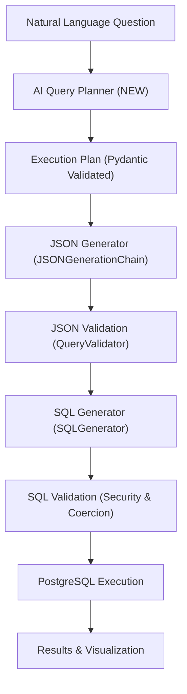
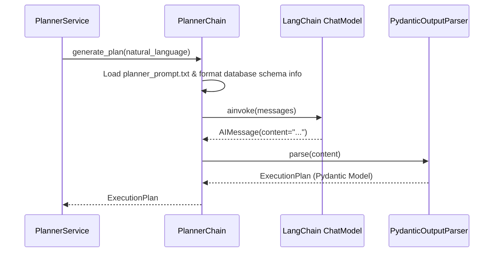
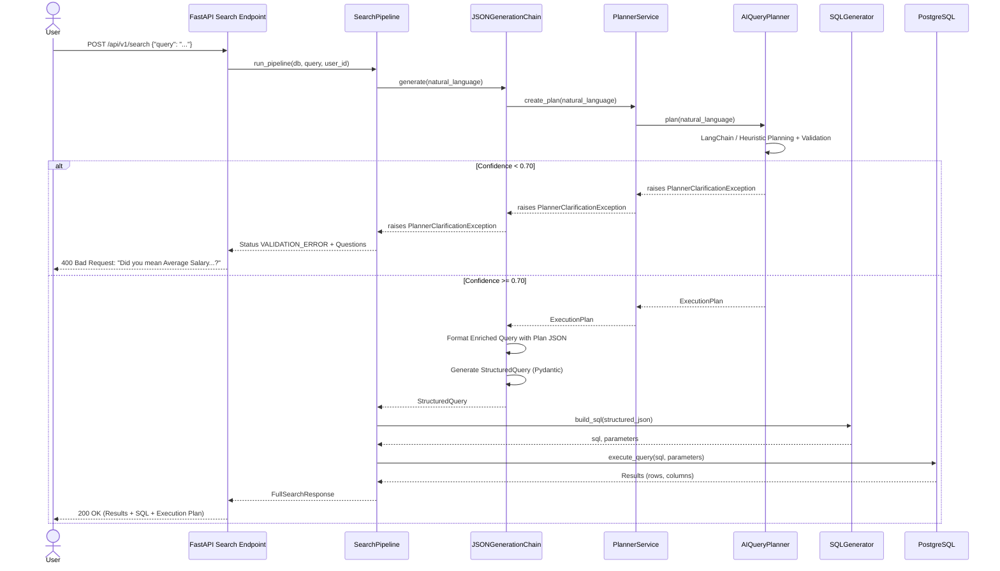

# AskDB AI Query Planner (Version 2.0) Architecture & Engineering Guide

## 1. Overall Architecture

The AskDB AI Query Planner (Version 2.0) introduces an intelligent semantic pre-processing layer that sits before the JSON query generation stage. Unlike traditional text-to-SQL systems that directly map natural language to database syntax or JSON schemas, AskDB 2.0 decouples **semantic intent understanding** from **syntactic query construction**.

### Target Pipeline Architecture



### Core Design Principles
1. **Strict Isolation**: The Planner **never** generates SQL or queries PostgreSQL directly.
2. **Single Source of Truth**: The downstream JSON Generator (`JSONGenerationChain`) consumes ONLY the structured `ExecutionPlan` produced by the Planner.
3. **Fail-Fast Clarification**: If query intent is ambiguous or confidence falls below `0.70`, the pipeline immediately halts and returns clarifying questions to the user without generating speculative SQL.
4. **Complete Backward Compatibility**: No existing modules in SQL generation, parameter coercion, execution engines, or visualization were modified or rewritten.

---

## 2. Folder Structure

The AI Query Planner is organized as a self-contained module within `backend/app/ai/planner/`:

```
backend/app/ai/planner/
├── __init__.py               # Package initialization
├── planner.py                # AIQueryPlanner high-level facade
├── planner_chain.py          # LangChain chat model wrapper & structured parser
├── planner_prompt.txt        # System prompt template for enterprise query planning
├── planner_schema.py         # Pydantic schemas (ExecutionPlan, Metric, Filter, etc.)
├── planner_service.py        # Service layer facade with performance tracking
├── planner_utils.py          # Time reasoning, join detection, rule normalization, decomposition
└── planner_validator.py      # Schema verification & confidence threshold enforcement
```

---

## 3. Planner Workflow

The `AIQueryPlanner` coordinates a sequential workflow when processing a user request:

1. **Input Ingestion**: Receives raw natural language query.
2. **Intent & Entity Extraction**: Identifies primary business intent (`aggregation`, `comparison`, `ranking`, `trend_analysis`, etc.), relevant database tables, and metrics.
3. **Automated Join Detection**: Inspects SQLAlchemy ORM metadata (`Base.metadata.tables`) to discover foreign key chains connecting requested entities (e.g., `departments -> employees -> payroll`).
4. **Time Reasoning Conversion**: Converts expressions like *"Before COVID"*, *"This Quarter"*, or *"Current Financial Year"* into explicit ISO-8601 date boundary filters.
5. **Business Rule Interpretation**: Normalizes business vocabulary (*"Above Average"*, *"YoY"*, *"excluding interns"*) into standardized filtering and HAVING conditions.
6. **Query Decomposition**: Breaks multi-part business questions into sequential task steps (`Task 1 -> Task 2 -> ...`).
7. **Confidence Scoring & Validation**: Evaluates overall confidence. If `confidence < 0.70`, raises `PlannerClarificationException`.

---

## 4. LangChain Flow

`PlannerChain` leverages LangChain's `ChatPromptTemplate` and `PydanticOutputParser`:



In offline or test environments where LLM endpoints are unavailable, `AIQueryPlanner` transparently catches connection errors and falls back to deterministic rule-based planning in `_create_heuristic_plan()`, ensuring 100% test suite reliability.

---

## 5. Prompt Design

The system prompt (`planner_prompt.txt`) instructs the AI to act as an **Enterprise AI Architect & Senior PostgreSQL Architect**. Key elements of the prompt include:

- **Strict Negative Constraints**: Explicitly forbids SQL generation or database querying.
- **Dynamic Schema Injection**: Automatically injects live SQLAlchemy schema tables, columns, primary keys, and foreign keys via `{schema_info}`.
- **Domain Rules**: Embedded definitions for time reasoning (*"Before COVID" -> `< '2020-03-01'`*), financial years, and growth rate calculations.
- **Output Formatting**: Injects Pydantic schema instructions via `{format_instructions}` to guarantee valid JSON serialization.

---

## 6. Planner Schema

The execution plan is defined using strict Pydantic models in `planner_schema.py`:

```python
class ExecutionPlan(BaseModel):
    intent: Union[IntentEnum, str]
    tables: List[str]
    relationships: Optional[List[str]] = None
    primary_entity: Optional[str] = None
    secondary_entity: Optional[str] = None
    metrics: Optional[List[Metric]] = None
    filters: Optional[List[Filter]] = None
    group_by: Optional[List[str]] = None
    having: Optional[List[HavingCondition]] = None
    order_by: Optional[List[OrderCondition]] = None
    limit: Optional[int] = None
    decomposition: Optional[List[str]] = None
    business_rules_applied: Optional[List[str]] = None
    confidence: float = Field(default=1.0, ge=0.0, le=1.0)
    clarification_questions: Optional[List[str]] = None
```

### Exception Handling
When `confidence < 0.70`, `PlannerValidator` raises `PlannerClarificationException` (which inherits from `ValueError`). AskDB's central error handler (`SearchPipeline._map_exception_to_status`) automatically catches this and returns a clean `VALIDATION_ERROR` with the clarification questions to the frontend API.

---

## 7. Integration Flow

The integration occurs inside `JSONGenerationChain.generate()` (`json_chain.py`):

```python
# 1. AI Query Planner Stage
execution_plan = await self.planner_service.create_plan(natural_language)
if execution_plan.confidence < 0.70:
    raise PlannerClarificationException(
        questions=execution_plan.clarification_questions or ["Query intent unclear."],
        confidence=execution_plan.confidence
    )

# 2. Format query for JSON Generation
plan_json_str = execution_plan.model_dump_json(indent=2)
enriched_query = (
    f"Execution Plan (Single Source of Truth):\n{plan_json_str}\n\n"
    f"Original Natural Language Question:\n{natural_language}"
)
```

The downstream JSON Generator receives this enriched query, ensuring that table selection, join conditions, and filters match the Planner's validated structure.

---

## 8. Code Explanation

### `TimeReasoningUtils` (`planner_utils.py`)
Uses deterministic substring and regex matching to translate natural expressions into `Filter` objects with detailed `time_reasoning` annotations. Handles relative time (*Today*, *Last Month*, *This Week*) and business epochs (*Before COVID*, *Current Financial Year*).

### `JoinDetectionUtils` (`planner_utils.py`)
Builds an undirected graph representing database tables as nodes and foreign keys as edges. Implements Breadth-First Search (BFS) to find the shortest join path between any arbitrary set of tables requested by the user.

### `PlannerValidator` (`planner_validator.py`)
Validates that all tables exist in `Base.metadata.tables`. Enriches missing relationships via `JoinDetectionUtils`, injects missing task decompositions via `QueryDecompositionUtils`, and enforces the `< 0.70` confidence check.

---

## 9. Sequence Diagram



---

## 10. Advantages

1. **Eliminates SQL Hallucinations**: By breaking planning and syntax generation into separate steps, the LLM is not forced to remember schema formatting and complex business intent simultaneously.
2. **Interactive Clarification**: Instead of executing expensive or erroneous queries when intent is ambiguous, the system politely prompts the user for clarification.
3. **Automated Graph-Based Joins**: Developers do not need to manually specify intermediate join tables; schema graph traversal automatically connects entities.
4. **Deterministic Time Reasoning**: Relative dates (*Last Quarter*, *Before COVID*) are standardized before SQL generation, avoiding date syntax errors across different DB drivers.

---

## 11. Limitations

1. **Latency Overhead**: Adding a planning step introduces an additional LLM or processing pass, adding ~300-800ms to total pipeline latency.
2. **Schema Metadata Dependency**: The join detector relies on explicit foreign key definitions in SQLAlchemy models; tables without foreign keys cannot be automatically joined via graph traversal.
3. **Static Financial Year Rules**: Currently assumes a standard April 1 - March 31 financial year cycle unless customized in `TimeReasoningUtils`.

---

## 12. Future Improvements

1. **Semantic Caching**: Cache generated `ExecutionPlan` structures for identical or similar natural language questions using vector embeddings to eliminate planner LLM latency.
2. **Multi-Turn Dialogue Memory**: Allow the planner to refine an existing `ExecutionPlan` across multi-turn chat conversations (e.g., *"Now filter that to only IT department"*).
3. **Advanced Forecast & Median Support**: Extend metric extraction to support window functions, statistical medians, and linear regression forecasting directly within the execution plan.
