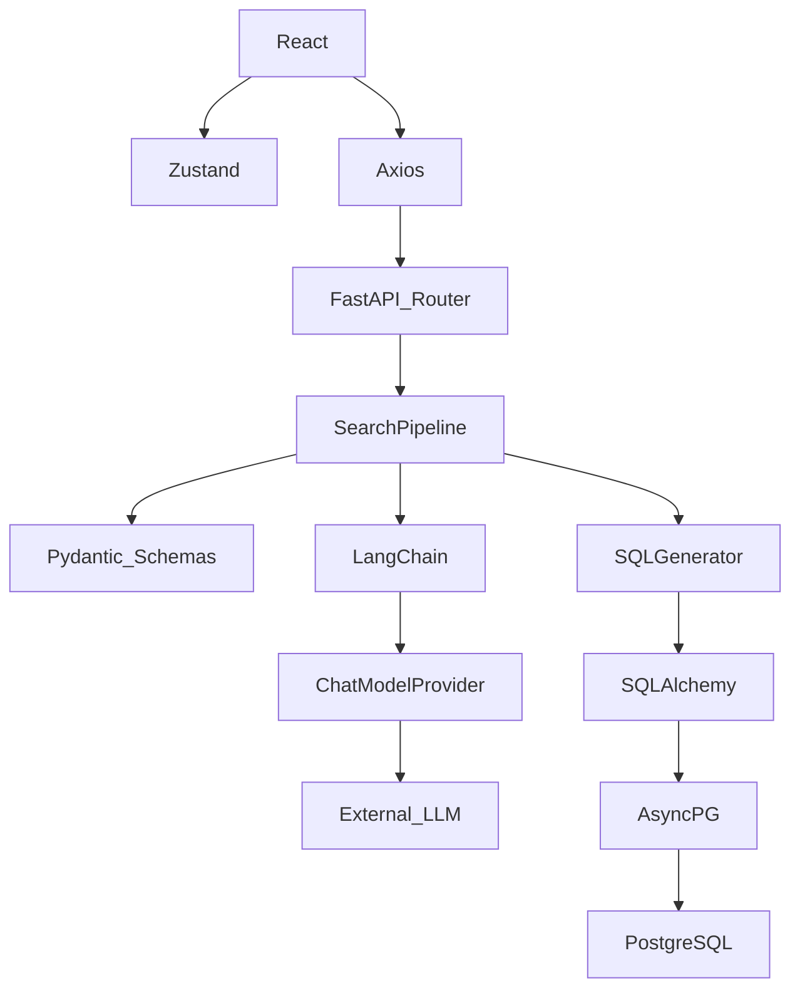
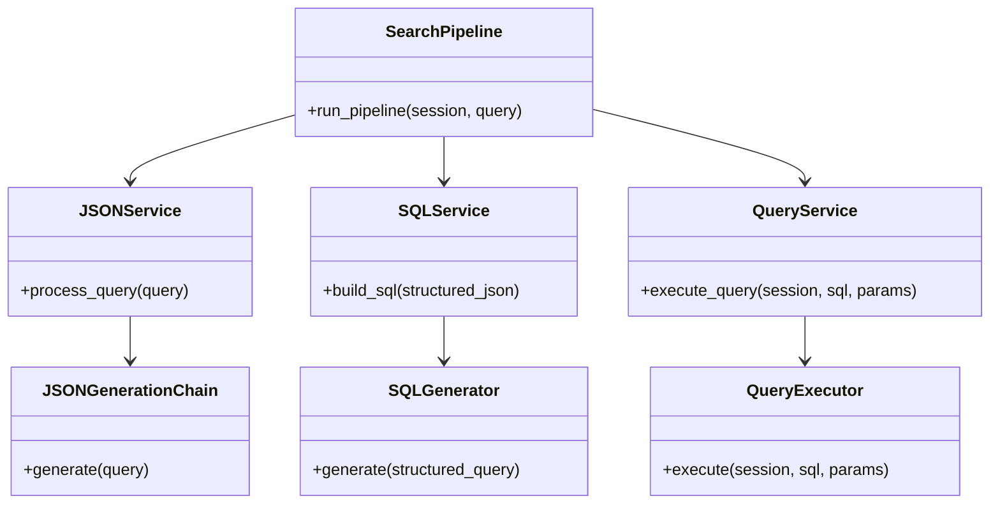

# Libraries and Implementation Guide

This document is a comprehensive technical guide detailing every major library, framework, parser, and design pattern used in the AskDB project. It is strictly based on the actual implementation of the codebase.

---

## 1. Project Technology Stack

The project relies on a modern, decoupled asynchronous stack.

| Technology | Version | Purpose | Used In |
|------------|----------|----------|----------|
| **FastAPI** | `0.110.0` | Primary REST API framework. Chosen for async speed and Pydantic integration. | Backend API |
| **Uvicorn** | `0.29.0` | ASGI web server running FastAPI. | Backend Server |
| **SQLAlchemy** | `2.0.28` | ORM used exclusively for schema introspection and async execution. | Backend Database |
| **AsyncPG** | `0.29.0` | High-performance asynchronous PostgreSQL database driver. | Backend Database |
| **Pydantic** | `2.13.4` | Data validation, API schemas, and LLM structured output schemas. | Backend Core |
| **LangChain** | `1.3.10` | LLM orchestration, prompt formatting, and parsing. | Backend AI |
| **Tenacity** | `8.5.0` | Retry mechanisms for LLM calls. | Backend AI |
| **React** | `19.2.6` | UI rendering framework. | Frontend UI |
| **TypeScript** | `~6.0.2` | Static typing for frontend codebase. | Frontend UI |
| **Vite** | `8.0.12` | Build tool and fast HMR development server. | Frontend Build |
| **TailwindCSS**| `4.3.1` | Utility-first styling. | Frontend UI |
| **Zustand** | `5.0.14` | Lightweight state management (e.g., `appStore`). | Frontend State |
| **Axios** | `1.18.0` | HTTP client for making REST calls to FastAPI. | Frontend Services |
| **Framer Motion**| `12.40.0`| UI animations and transitions. | Frontend UI |

---

## 2. Complete Library Flow

Tracing a complete request from UI through the libraries:

**User Query**
↓
**Zustand** (Frontend state tracking the query)
↓
**Axios** (`searchApi.executeSearch` making POST request)
↓
**FastAPI** (`@router.post("/search")` endpoint receives payload)
↓
**Pydantic Request Model** (`FullSearchRequest` validates incoming HTTP payload)
↓
**SearchPipeline** (Orchestrates service layer)
↓
**PromptService** (Loads text prompt template from `json_generation.txt`)
↓
**LangChain ChatPromptTemplate** (Injects DB schema and variables)
↓
**LangChain BaseChatModel** (e.g., `ChatGroq`, routes request via provider SDK)
↓
**LangChain PydanticOutputParser** (Parses raw LLM string into JSON)
↓
**Pydantic StructuredQuery Model** (Strictly validates LLM generated JSON fields/operators)
↓
**SQLGenerator** (Translates Pydantic model into Parameterized SQL strings)
↓
**SQLAlchemy AsyncSession** (`session.execute()` runs the SQL with parameters)
↓
**AsyncPG** (Sends raw protocol requests to PostgreSQL)
↓
**PostgreSQL** (Executes query)
↓
**FastAPI Response Model** (`FullSearchResponse` serializes to JSON)
↓
**React / Tailwind** (Renders `ResultTable` and `SqlViewer`)

---

## 3. Pydantic

AskDB heavily relies on Pydantic `2.13.4` for both API validation and LLM output parsing.

**Components Used:**
* `BaseModel`: Inherited by all data schemas (e.g., `StructuredQuery`, `SearchRequest`).
* `Field`: Adds descriptions used by LangChain to instruct the LLM. e.g., `Field(description="The primary table to query from")`.
* `Enum`: Used to restrict operator values (e.g., `OperatorEnum`).
* `model_dump()`: Converts the validated model into a dictionary before passing to `SQLGenerator`.

**Example: LLM JSON Validation (`app/ai/structured_output/schemas.py`)**
```python
class FilterCondition(BaseModel):
    table: Optional[str] = Field(default=None, description="The table this field belongs to")
    field: str = Field(description="The column name to filter on")
    operator: OperatorEnum = Field(description="The comparison operator")
    value: str | int | float | list[str] | list[int] | list[float] | None = Field(default=None)

class StructuredQuery(BaseModel):
    table: str = Field(description="The primary table to query from")
    columns: List[str] = Field(description="List of columns to select.")
    filters: Optional[List[FilterCondition]] = Field(default=None)
    # ...
```

**Why it's used:**
1. **API Validation:** `FullSearchRequest` ensures the frontend sends valid payloads.
2. **LLM Output Validation:** `StructuredQuery` acts as a firewall. If the LLM returns an invalid operator (e.g., `MATCHES`), Pydantic raises a `ValidationError`, caught by the `SearchPipeline` to either retry or fail safely.

---

## 4. LangChain

LangChain is used as an orchestrator to manage LLM API calls and parsers.

**Components Used in AskDB:**
* `ChatPromptTemplate`: Located in `JSONGenerationChain`. Used to inject system instructions and format variables (`schema_info`, `query`).
* `PydanticOutputParser`: Translates the Pydantic `StructuredQuery` model into a JSON schema prompt instruction for the LLM (`get_format_instructions()`). Once the LLM responds, `parser.parse(response.content)` turns the raw string back into the `StructuredQuery` Python object.
* `BaseChatModel`: The interface implemented by various LLM providers (`ChatGroq`, `ChatOpenAI`, etc.).

**Implementation Example (`app/ai/chains/json_chain.py`):**
```python
self.parser = PydanticOutputParser(pydantic_object=StructuredQuery)
prompt_template = ChatPromptTemplate.from_template(prompt_text)

messages = prompt_template.format_messages(
    schema_info=self.schema_info,
    query=natural_language,
    format_instructions=self.parser.get_format_instructions()
)
response = await self.llm.ainvoke(messages)
structured_query = self.parser.parse(response.content)
```

---

## 5. LLM Providers

AskDB abstracts LLMs using a Factory Pattern in `app/core/providers/factory.py`. 

**Implementations:**
* **GroqProvider**: Uses `langchain_groq.ChatGroq`. High-speed inference using models like `qwen/qwen3-32b`.
* **OpenAIProvider**: Uses `langchain_openai.ChatOpenAI`. 
* **GeminiProvider**: Uses `langchain_google_genai.ChatGoogleGenerativeAI`.
* **AnthropicProvider**: Uses `langchain_anthropic.ChatAnthropic`.
* **OllamaProvider**: Uses `langchain_ollama.ChatOllama` for local, private execution.

**How it works:**
The `ProviderFactory` singleton determines the active provider at runtime based on settings (or dynamic configuration). Calling `ProviderFactory.get_instance().get_llm()` returns a LangChain `BaseChatModel` instance authenticated with the correct API key stored in `BaseSettings`.

---

## 6. Prompt Engineering

Prompts are managed externally from python code for better maintainability.

* **Storage**: Prompts are stored as raw `.txt` files in `app/prompts/`.
* **Loading**: The `PromptService` (`app/services/ai/prompt_service.py`) dynamically reads `json_generation.txt`.
* **Injection**: In `JSONGenerationChain`, SQLAlchemy `Base.metadata.tables` is iterated over to dynamically build a string representation of the database schema (Tables, Columns, Enums, Primary Keys, Foreign Keys). This `schema_info` is injected into the prompt alongside the `query` and Pydantic's `format_instructions`.

---

## 7. Output Parsing

1. The LLM returns a raw JSON string.
2. `self.parser.parse(response.content)` catches the string.
3. LangChain uses the `PydanticOutputParser` to load the JSON.
4. Pydantic instantiates the `StructuredQuery` model. If types mismatch or required fields are missing, a `ValueError` / `ValidationError` is thrown.
5. **Retry Logic**: AskDB wraps the chain's `generate()` method with the `tenacity` library (`@retry(wait=wait_exponential...)`). If parsing fails, Tenacity automatically retries the LLM call up to 3 times.

---

## 8. SQL Generation

Instead of asking AI to write SQL, AskDB uses `SQLGenerator` (`app/query_builder/sql_generator.py`) to deterministically build SQL strings from the `StructuredQuery` object.

**How it works:**
* **SELECT**: Joins `query.columns`.
* **FROM**: Appends `query.table`.
* **WHERE**: Iterates through `query.filters`. Translates Pydantic objects into safe SQL clauses and captures parameter values in a dictionary.
* **Prepared Statements**: Instead of string concatenation (which causes SQL injection), it injects asyncpg compatible parameter markers (e.g., `:hire_date_1`).
* **Why Python?**: Generating SQL in Python guarantees syntax correctness, prevents hallucinations, strictly enforces table access, and natively binds SQL execution parameters.

---

## 9. SQLAlchemy & Database Driver

SQLAlchemy is utilized solely as an execution layer and schema registry, not for heavy ORM querying.

* **Connection Pool**: `create_async_engine` (`app/database/connection.py`) manages a pool of connections (`pool_size=5`).
* **Session Management**: `async_sessionmaker` and the `get_db()` FastAPI dependency yield an `AsyncSession` per HTTP request.
* **Execution**: The `QueryExecutor` uses `session.execute(text(sql), parameters)` to run the dynamically generated SQL.
* **Row Mapping**: The SQLAlchemy `Result` object provides `.mappings().all()`, which parses the DB rows directly into a list of Python dictionaries for easy JSON serialization.
* **asyncpg**: The underlying driver (`postgresql+asyncpg://`) allows non-blocking database I/O, meaning the FastAPI server can handle hundreds of concurrent requests without thread starvation.

---

## 10. FastAPI

FastAPI wires the entire backend together using native Python typing.

* **APIRouter**: Separates routes (e.g., `app/api/v1/endpoints/search.py`).
* **Depends**: The core Dependency Injection system. It injects `SearchPipeline` and `AsyncSession` into endpoint controllers.
* **Models**: Request/Response lifecycle is strictly typed. e.g. `@router.post("", response_model=FullSearchResponse)`.
* **HTTPException**: Caught domain exceptions (like `ValueError` for bad security queries) are mapped to HTTP `403` or `400` codes for the frontend.

---

## 11. Frontend Libraries

The frontend is a `React 19` application scaffolded with `Vite`.

* **TypeScript**: Enforces typing matching the FastAPI schemas (e.g. `types/search.ts`).
* **Axios**: Configured in `services/search.service.ts` to execute async HTTP requests to the FastAPI backend.
* **Zustand**: Used in `store/appStore.ts` and `themeStore.ts` to manage global state without the boilerplate of Redux.
* **Tailwind CSS**: Used for all styling (e.g., `bg-gradient-to-r from-violet-500`).
* **Framer Motion**: Powers the smooth staggered animations and component entering/exiting.
* **Lucide React**: Provides SVG icons.

---

## 12. Folder Responsibilities

* **`backend/app/core/providers/`**: Implementations for all external LLM SDKs (Groq, OpenAI, etc.).
* **`backend/app/api/v1/endpoints/`**: FastAPI REST controller logic.
* **`backend/app/services/`**: The Application Layer orchestrators (`search_pipeline.py`).
* **`backend/app/ai/chains/`**: LangChain orchestration logic combining Prompts, Parsers, and LLMs.
* **`backend/app/ai/structured_output/`**: The crucial Pydantic schemas acting as the AI/Code boundary.
* **`backend/app/query_builder/`**: Deterministic Python generators creating executable parameterised SQL from JSON.
* **`frontend/src/store/`**: Zustand global state containers.
* **`frontend/src/services/`**: Axios API client wrapper classes.

---

## 13. Dependency Graph



---

## 14. Class Dependency Diagram



---

## 15. Developer Notes

**Why FastAPI?** 
Native async support and first-class Pydantic integration make it superior to Flask/Django for high-I/O LLM orchestration. 
**Why AsyncPG over psycopg2?** 
It is explicitly designed for `asyncio`, offering massive throughput improvements over traditional synchronous thread-pooling.
**Why LangChain?** 
While sometimes bloated, it standardizes the interface between differing LLM Providers (Groq, OpenAI, Claude), allowing the `ProviderFactory` to swap them easily without changing the core chain logic.
**Why Zustand over Redux?** 
Redux requires excessive boilerplate. Zustand uses a simple hook-based store that fits perfectly into modern React functional components.

---

## 16. Best Practices

1. **Dependency Injection:** `FastAPI` injects database sessions and Pipeline orchestrators. This makes endpoints easily unit-testable.
2. **Provider Factory Pattern:** LLM implementation details are hidden behind `ProviderFactory`. `JSONGenerationChain` doesn't know if it's talking to Groq or local Ollama.
3. **Defense in Depth (Validation):** Input is validated via HTTP payload (`SearchRequest`). LLM output is validated via Pydantic (`StructuredQuery`). SQL generation uses bounded parameters. Execution catches raw SQL exceptions.
4. **Separation of Concerns:** Prompts live in `.txt` files. AI orchestration lives in `chains/`. SQL logic lives in `query_builder/`.

---

## 17. Conclusion

AskDB relies on a precise sequence of specialized libraries. **LangChain** structures the context and communicates with the LLM via the **ProviderFactory**. The LLM's raw text is strictly cast into Python objects using **Pydantic**. These objects are mapped into parameterized queries by the deterministic **SQLGenerator**. Finally, **FastAPI**, **SQLAlchemy**, and **AsyncPG** provide a fully non-blocking asynchronous pipeline to execute the queries securely and return them to the **React** frontend.
